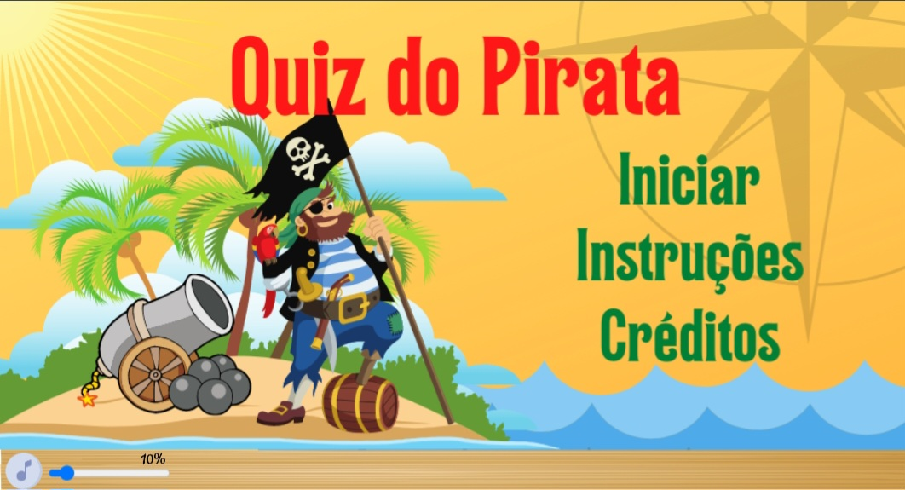

# quiz_pirata_p5js

> Jogo desenvolvido para antender algumas nescessidades educacionais

**projeto da disciplina:**

**Tecnologias Ultilizadas**: 
- 
- 

## 🕹️ Descrição do jogo

    

Tela inicial do jogo Quiz do Pirata

Vocês estão prontas crianças? No **Quiz do Pirata** você  terá que ajudar o pirata Miguel à capturar os baús do tesouro. Mas para isso, você terá que responder algumas cálculos básicos de **matemática**. lembre-se que existem ordens a se seguir nos cálculos! primeiro os **parênteses**, segundo as operações de **multiplicação** e **divisão** e por último as operações de **soma** e **subtração**. Caso apareça em uma pergunta uma multiplicação e divisão ao 
mesmo tempo, dê prioridade da esquerda para direita. 

## 🎯 Objetivo

Este jogo foi desenvolvido para os alunos do **6° ano** do ensino fundamental. Ele contempla a seguinte norma da **base nacional comum curricular (BNCC)**:

- **EF06MA16**: Associar pares ordenados de números a pontos do plano cartesiano do 1º quadrante, em situações como a localização dos vértices de um polígono.

## 👨‍💻 Como foi desenvolvido?

O jogo educativo foi desenvolvido utilizando os princípios de lógica de programação aprendidos durante a disciplina, com foco nas seguintes áreas:

1. **Estruturas Condicionais**: Foram utilizadas estruturas condicionais, como `if`, `else` e `elif`, para controlar o fluxo do jogo com base nas escolhas do jogador. Por exemplo, ao selecionar uma opção em um menu, o jogo verifica a escolha do jogador e exibe o resultado correspondente.

2. **Repetições**: Utilizamos loops, como `for` e `while`, para repetir ações no jogo, como exibir uma lista de itens ou realizar uma sequência de eventos. Por exemplo, foram usados loops para criar efeitos de animação dos objetos.

3. **Funções**: Criamos funções para organizar o código do jogo em blocos reutilizáveis. Por exemplo, uma função pode ser criada para exibir uma mensagem na tela, facilitando a exibição de mensagens em diferentes partes do jogo.

O jogo foi desenvolvido com o objetivo de aplicar de forma prática os conceitos de estruturas condicionais, repetições e funções, proporcionando uma experiência de aprendizado interativa e envolvente para os jogadores.

## 🤔 Como jogar?

Ao dar inicio ao jogo, por alguns isntantes, aparecerá uma pergunta, você deve responder o cálculo metalmente, logo em seguida você deverá posicionar o canhão e o baú em posições especificadas pelas **cordenadas (x,y)**. Após o posicionamento, você deverá acertar o baú com a bala ao clicar em **"FOGO!"**, ao acertar o baú, você terá que clicar na resposta correta da pergunta que apareceu no início da fase.

## 🎮 Vamos Jogar?

Acesse este [link](https://carlosg18.github.io/quiz_pirata_p5js/) para poder jogar o meu jogo! espero que goste da jogatina! divirta-se 👋! 

## 🗣️ Deixe seu feedback

Quer deixar um feedback sobre o meu jogo? me mande uma mensagem:

📧 email: desenvolvimentodev55@gmail.com
